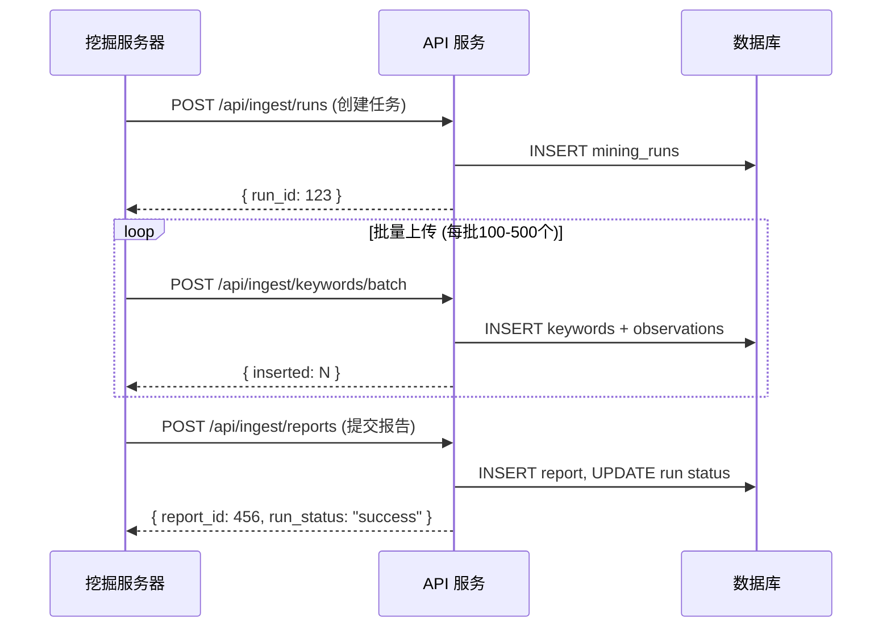

# AI 关键词挖掘系统 - API 接口文档

服务器端数据接入完整指南 - 关键词挖掘系统 API

---

## 概述

本系统提供 3 个核心 API 端点，用于服务器端上传关键词挖掘数据：

| 方法 | 端点 | 说明 |
|------|------|------|
| POST | `/api/ingest/runs` | 创建挖掘任务 |
| POST | `/api/ingest/keywords/batch` | 批量上传关键词 |
| POST | `/api/ingest/reports` | 上传分析报告 |

---

## 🔐 认证

所有 API 请求必须在请求头中包含 API Key：

```
X-API-Key: kwd_live_xxxxxxxxxxxxxxxxxxxxxxxxxxxxxxxx
```

> **注意**: API Key 前缀为 `kwd_live_`。请联系系统管理员获取 API Key。每个服务器应使用独立的 API Key。

---

## API 接口

### 1. 创建挖掘任务

**POST** `/api/ingest/runs`

创建新的关键词挖掘任务，返回 `run_id` 用于后续数据上传。

#### 请求体

```json
{
  "seed": "ai tools",
  "rounds": 3,
  "meta": {
    "source": "ahrefs",
    "region": "us",
    "api_version": "v3"
  }
}
```

| 字段 | 类型 | 必填 | 说明 |
|------|------|------|------|
| `seed` | string | ✅ | 种子关键词 |
| `rounds` | number | ❌ | 挖掘轮数，默认 1 |
| `meta` | object | ❌ | 元数据 (JSON) |

#### 响应

```json
{
  "success": true,
  "run_id": 123,
  "message": "Mining run created successfully",
  "server": "US-Server-01"
}
```

#### cURL 示例

```bash
curl -X POST http://localhost:3000/api/ingest/runs \
  -H "Content-Type: application/json" \
  -H "X-API-Key: kwd_live_xxxxxxxxxxxxxxxxxxxxxxxxxxxxxxxx" \
  -d '{
    "seed": "ai tools",
    "rounds": 3,
    "meta": {"source": "ahrefs", "region": "us"}
  }'
```

#### Python 示例

```python
import requests
from datetime import datetime

url = "http://localhost:3000/api/ingest/runs"
headers = {
    "Content-Type": "application/json",
    "X-API-Key": "kwd_live_xxxxxxxxxxxxxxxxxxxxxxxxxxxxxxxx"
}
data = {
    "seed": "ai tools",
    "rounds": 3,
    "meta": {"source": "ahrefs", "region": "us"}
}

response = requests.post(url, json=data, headers=headers)
print(response.json())
```

---

### 2. 批量上传关键词

**POST** `/api/ingest/keywords/batch`

批量上传关键词及其观察数据。

#### 请求体

```json
{
  "run_id": 123,
  "keywords": [
    {
      "keyword": "ai keyword tool",
      "search_volume": 8100,
      "difficulty": "medium",
      "intent": "commercial",
      "cpc": 2.5,
      "competition": 0.65,
      "trend": "stable",
      "score": 85.5,
      "serp_features": ["featured_snippet", "people_also_ask"],
      "related_queries": ["best ai tools", "ai writing tools"],
      "source": "ahrefs",
      "language": "en",
      "country": "US",
      "category": "ai-tools",
      "word_count": 3,
      "pain_point_flag": false,
      "raw_data": {}
    }
  ]
}
```

| 字段 | 类型 | 必填 | 说明 |
|------|------|------|------|
| `run_id` | number | ✅ | 任务 ID |
| `keywords` | array | ✅ | 关键词数组 |

**关键词对象字段：**

| 字段 | 类型 | 必填 | 说明 |
|------|------|------|------|
| `keyword` | string | ✅ | 关键词文本 |
| `search_volume` | number | ✅ | 月搜索量 |
| `difficulty` | string | ✅ | 难度: `low`, `medium`, `high` |
| `intent` | string | ✅ | 意图: `informational`, `navigational`, `commercial`, `transactional` |
| `score` | number | ✅ | 综合得分 (0-100) |
| `cpc` | number | ❌ | 每次点击成本 (美元) |
| `competition` | number | ❌ | 竞争度 (0-1) |
| `trend` | string | ❌ | 趋势: `up`, `down`, `stable` |
| `serp_features` | array | ❌ | SERP 特征列表 |
| `related_queries` | array | ❌ | 相关查询列表 |
| `source` | string | ❌ | 数据来源: `ahrefs`, `semrush`, `google` 等 |
| `language` | string | ❌ | 语言代码 (如 `en`) |
| `country` | string | ❌ | 国家代码 (如 `US`) |
| `category` | string | ❌ | 分类标签 |
| `word_count` | number | ❌ | 词数 |
| `pain_point_flag` | boolean | ❌ | 是否为痛点词 |
| `raw_data` | object | ❌ | 原始数据 (JSON) |

#### 响应

```json
{
  "success": true,
  "inserted": 150,
  "duplicates": 2,
  "total": 152,
  "message": "Keywords uploaded successfully"
}
```

#### Python 批量上传示例

```python
import requests
from datetime import datetime

url = "http://localhost:3000/api/ingest/keywords/batch"
headers = {
    "Content-Type": "application/json",
    "X-API-Key": "kwd_live_xxxxxxxxxxxxxxxxxxxxxxxxxxxxxxxx"
}

# 批量上传关键词
keywords = []
for kw_data in your_keyword_list:
    keywords.append({
        "keyword": kw_data["keyword"],
        "search_volume": kw_data["volume"],
        "difficulty": kw_data["difficulty"],
        "intent": kw_data["intent"],
        "score": calculate_score(kw_data),
        "cpc": kw_data.get("cpc"),
        "competition": kw_data.get("competition"),
        "trend": kw_data.get("trend")
    })

data = {
    "run_id": run_id,
    "keywords": keywords
}

response = requests.post(url, json=data, headers=headers)
print(response.json())
```

---

### 3. 上传分析报告

**POST** `/api/ingest/reports`

上传分析报告并更新任务状态。

#### 请求体

```json
{
  "run_id": 123,
  "title": "AI Tools 挖掘报告",
  "markdown": "# 分析报告\n\n## TOP 10 机会\n...",
  "json_data": {
    "summary": {
      "total_keywords": 500,
      "high_opportunity": 50,
      "avg_score": 75.5
    },
    "top_keywords": [
      {
        "keyword": "best ai tools 2026",
        "score": 95.0,
        "reason": "High volume, low competition"
      }
    ]
  },
  "status": "success"
}
```

| 字段 | 类型 | 必填 | 说明 |
|------|------|------|------|
| `run_id` | number | ✅ | 任务 ID |
| `title` | string | ❌ | 报告标题 |
| `markdown` | string | ❌ | 报告内容 (Markdown) |
| `json_data` | object | ❌ | 结构化数据 |
| `status` | string | ❌ | 任务状态: `success` 或 `failed` |

#### 响应

```json
{
  "success": true,
  "report_id": 456,
  "run_status": "success",
  "message": "Report uploaded successfully"
}
```

#### Python 报告生成示例

```python
import requests

url = "http://localhost:3000/api/ingest/reports"
headers = {
    "Content-Type": "application/json",
    "X-API-Key": "kwd_live_xxxxxxxxxxxxxxxxxxxxxxxxxxxxxxxx"
}

# 生成 Markdown 报告
markdown_report = f"""
# AI Tools 关键词挖掘报告

## 📊 统计概览
- 总关键词数: {total_keywords}
- 高价值机会: {high_opportunity}
- 平均得分: {avg_score}

## 🎯 TOP 10 机会
{generate_top_10_table(top_keywords)}

## 💡 核心洞察
{generate_insights(keywords_data)}
"""

# 生成 JSON 数据
report_json = {
    "summary": {
        "total_keywords": total_keywords,
        "high_opportunity": high_opportunity,
        "avg_score": avg_score
    },
    "top_keywords": top_keywords,
    "insights": insights
}

data = {
    "run_id": run_id,
    "title": "AI Tools 挖掘报告",
    "markdown": markdown_report,
    "json_data": report_json,
    "status": "success"
}

response = requests.post(url, json=data, headers=headers)
print(response.json())
```

---

## ⚠️ 错误处理

所有接口在失败时返回以下格式：

```json
{
  "success": false,
  "error": "错误描述",
  "details": "详细信息"
}
```

**常见错误：**

| 状态码 | 错误类型 | 说明 |
|--------|----------|------|
| 401 | Unauthorized | API Key 无效或缺失 |
| 400 | Bad Request | 请求参数错误或缺失必填字段 |
| 404 | Not Found | 资源不存在（如 run_id 无效） |
| 500 | Internal Server Error | 服务器内部错误 |

---

## 🔄 完整工作流示例

完整的关键词挖掘和上传流程：

```python
import requests
from datetime import datetime
import time

API_KEY = "kwd_live_xxxxxxxxxxxxxxxxxxxxxxxxxxxxxxxx"
BASE_URL = "http://localhost:3000/api/ingest"
headers = {
    "Content-Type": "application/json",
    "X-API-Key": API_KEY
}

# 步骤 1: 创建挖掘任务
print("步骤 1: 创建挖掘任务...")
run_data = {
    "seed": "ai keyword research tool",
    "rounds": 3,
    "meta": {
        "source": "ahrefs",
        "region": "us"
    }
}
response = requests.post(f"{BASE_URL}/runs", json=run_data, headers=headers)
run_id = response.json()["run_id"]
print(f"✅ 任务创建成功，ID: {run_id}")

# 步骤 2: 执行关键词挖掘（你的挖掘逻辑）
print("\n步骤 2: 执行关键词挖掘...")
keywords_data = perform_keyword_mining("ai keyword research tool")

# 步骤 3: 批量上传关键词
print(f"\n步骤 3: 批量上传 {len(keywords_data)} 个关键词...")
batch_size = 100
for i in range(0, len(keywords_data), batch_size):
    batch = keywords_data[i:i+batch_size]
    keywords_batch = []
    for kw in batch:
        keywords_batch.append({
            "keyword": kw["keyword"],
            "search_volume": kw["volume"],
            "difficulty": kw["difficulty"],
            "intent": kw["intent"],
            "score": kw["score"],
            "cpc": kw.get("cpc"),
            "competition": kw.get("competition"),
            "trend": kw.get("trend")
        })
    
    batch_data = {
        "run_id": run_id,
        "keywords": keywords_batch
    }
    response = requests.post(f"{BASE_URL}/keywords/batch", json=batch_data, headers=headers)
    result = response.json()
    print(f"  ✅ 已上传 {result.get('inserted', 0)} 个关键词")
    time.sleep(0.5)  # 避免请求过快

# 步骤 4: 生成并上传分析报告
print("\n步骤 4: 生成并上传分析报告...")
report_data = {
    "run_id": run_id,
    "title": f"AI Keyword Research - {datetime.now().strftime('%Y-%m-%d')}",
    "markdown": generate_markdown_report(keywords_data),
    "json_data": generate_json_report(keywords_data),
    "status": "success"
}
response = requests.post(f"{BASE_URL}/reports", json=report_data, headers=headers)
print(f"✅ 报告上传成功，ID: {response.json()['report_id']}")

print("\n🎉 完整工作流执行成功！")
```

---

## 💡 最佳实践

1. **批量上传关键词**：建议每批 100-500 个，避免单次请求过大
2. **请求间隔**：添加适当的请求间隔（如 500ms），避免触发速率限制
3. **错误重试**：使用 try-except 捕获网络错误，实现自动重试机制
4. **保存 run_id**：用于后续关键词上传和报告关联
5. **更新任务状态**：任务完成后，通过上传报告时的 `status` 字段更新为 `success` 或 `failed`
6. **双格式报告**：建议同时提供 Markdown 和 JSON 两种格式，便于展示和数据分析

---

## 数据库表结构

### 1. mining_servers (服务器)

| 字段 | 类型 | 说明 |
|------|------|------|
| `id` | SERIAL | 主键 |
| `name` | VARCHAR(255) | 服务器名称 |
| `region` | VARCHAR(100) | 地区 |
| `api_key_hash` | VARCHAR(255) | API Key 哈希 |
| `created_at` | TIMESTAMP | 创建时间 |
| `updated_at` | TIMESTAMP | 更新时间 |

---

### 2. mining_runs (挖掘任务)

| 字段 | 类型 | 说明 |
|------|------|------|
| `id` | SERIAL | 主键 |
| `miner_id` | INTEGER | 关联服务器 ID |
| `seed` | VARCHAR(255) | 种子关键词 |
| `rounds` | INTEGER | 挖掘轮次 |
| `status` | VARCHAR(50) | 状态: `running`, `success`, `failed` |
| `started_at` | TIMESTAMP | 开始时间 |
| `ended_at` | TIMESTAMP | 结束时间 |
| `meta_json` | TEXT | 元数据 (JSON) |
| `created_at` | TIMESTAMP | 创建时间 |
| `updated_at` | TIMESTAMP | 更新时间 |

---

### 3. keywords (关键词主表)

| 字段 | 类型 | 说明 |
|------|------|------|
| `id` | SERIAL | 主键 |
| `keyword` | VARCHAR(255) | 原始关键词 |
| `keyword_norm` | VARCHAR(255) | 标准化关键词 (唯一) |
| `language` | VARCHAR(20) | 语言 |
| `country` | VARCHAR(100) | 国家 |
| `category` | VARCHAR(100) | 分类 |
| `first_seen_at` | TIMESTAMP | 首次发现时间 |
| `last_seen_at` | TIMESTAMP | 最后发现时间 |
| `created_at` | TIMESTAMP | 创建时间 |
| `updated_at` | TIMESTAMP | 更新时间 |

---

### 4. keyword_observations (观察数据)

| 字段 | 类型 | 说明 |
|------|------|------|
| `id` | SERIAL | 主键 |
| `keyword_id` | INTEGER | 关联关键词 ID |
| `run_id` | INTEGER | 关联任务 ID |
| `source` | VARCHAR(100) | 数据来源 |
| `score` | DECIMAL(5,2) | 评分 |
| `search_volume` | INTEGER | 搜索量 |
| `difficulty` | VARCHAR(20) | 难度 |
| `intent` | VARCHAR(255) | 意图 |
| `word_count` | INTEGER | 词数 |
| `pain_point_flag` | BOOLEAN | 痛点标识 |
| `raw_json` | TEXT | 原始数据 (JSON) |
| `created_at` | TIMESTAMP | 创建时间 |
| `updated_at` | TIMESTAMP | 更新时间 |

---

### 5. keyword_reports (分析报告)

| 字段 | 类型 | 说明 |
|------|------|------|
| `id` | SERIAL | 主键 |
| `run_id` | INTEGER | 关联任务 ID |
| `title` | VARCHAR(255) | 报告标题 |
| `report_markdown` | TEXT | 报告内容 (Markdown) |
| `report_json` | TEXT | 结构化数据 (JSON) |
| `created_at` | TIMESTAMP | 创建时间 |
| `updated_at` | TIMESTAMP | 更新时间 |

---

### 6. keyword_notes (关键词备注)

| 字段 | 类型 | 说明 |
|------|------|------|
| `id` | SERIAL | 主键 |
| `keyword_id` | INTEGER | 关联关键词 ID |
| `run_id` | INTEGER | 关联任务 ID |
| `type` | VARCHAR(50) | 类型: `ai_summary`, `dev_suggestion`, `business_value`, `risk` |
| `content` | TEXT | 备注内容 |
| `created_at` | TIMESTAMP | 创建时间 |
| `updated_at` | TIMESTAMP | 更新时间 |

---

## 使用流程


