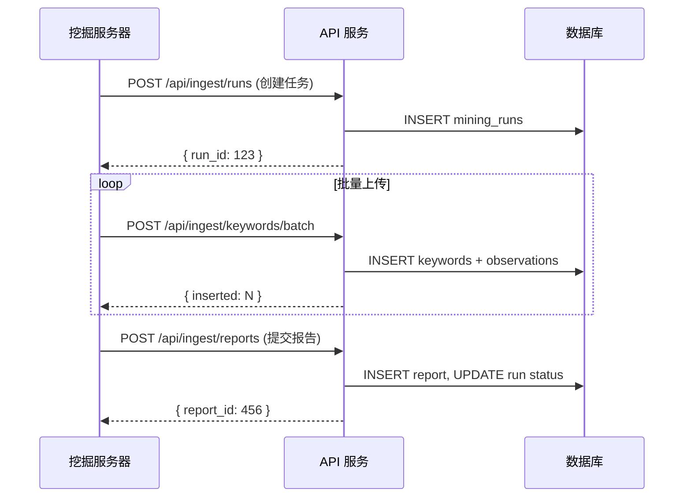

# AI 关键词挖掘系统 - API 接口文档

本文档描述了关键词挖掘系统的数据上传 API 接口，供服务器端调用。

---

## 认证方式

所有 API 请求需要在请求头中包含 API Key：

```
X-API-Key: kwd_live_xxxxxxxxxxxxxxxxxxxxxxxxxxxxxxxx
```

> **注意**: API Key 前缀为 `kwd_live_`，在管理后台创建。

---

## API 接口

### 1. 创建挖掘任务

**POST** `/api/ingest/runs`

创建新的关键词挖掘任务，返回 `run_id` 用于后续数据上传。

#### 请求体

```json
{
  "seed": "bitcoin price",
  "rounds": 3,
  "meta": {
    "source": "ahrefs",
    "region": "us"
  }
}
```

| 字段 | 类型 | 必填 | 说明 |
|------|------|------|------|
| `seed` | string | ✅ | 关键词种子 |
| `rounds` | number | ❌ | 挖掘轮次，默认 1 |
| `meta` | object | ❌ | 额外元数据 (JSON) |

#### 响应

```json
{
  "success": true,
  "run_id": 123,
  "message": "Mining run created successfully",
  "server": "US-Server-01"
}
```

---

### 2. 批量上传关键词

**POST** `/api/ingest/keywords/batch`

批量上传关键词及其观察数据。

#### 请求体

```json
{
  "run_id": 123,
  "keywords": [
    {
      "keyword": "bitcoin price today",
      "score": 85.5,
      "search_volume": 50000,
      "difficulty": "medium",
      "intent": "informational",
      "source": "ahrefs",
      "language": "en",
      "country": "US",
      "category": "crypto",
      "word_count": 3,
      "pain_point_flag": false,
      "raw_data": {}
    }
  ]
}
```

| 字段 | 类型 | 必填 | 说明 |
|------|------|------|------|
| `run_id` | number | ✅ | 任务 ID |
| `keywords` | array | ✅ | 关键词数组 |

**关键词对象字段：**

| 字段 | 类型 | 必填 | 说明 |
|------|------|------|------|
| `keyword` | string | ✅ | 关键词文本 |
| `score` | number | ❌ | 评分 (0-100) |
| `search_volume` | number | ❌ | 月搜索量 |
| `difficulty` | string | ❌ | 难度: `low`, `medium`, `high` |
| `intent` | string | ❌ | 搜索意图: `informational`, `transactional`, `navigational`, `commercial` |
| `source` | string | ❌ | 数据来源: `ahrefs`, `semrush`, `google` 等 |
| `language` | string | ❌ | 语言代码 (如 `en`) |
| `country` | string | ❌ | 国家代码 (如 `US`) |
| `category` | string | ❌ | 分类标签 |
| `word_count` | number | ❌ | 词数 |
| `pain_point_flag` | boolean | ❌ | 是否为痛点词 |
| `raw_data` | object | ❌ | 原始数据 (JSON) |

#### 响应

```json
{
  "success": true,
  "inserted": 98,
  "duplicates": 2,
  "total": 100,
  "message": "Keywords uploaded successfully"
}
```

---

### 3. 上传分析报告

**POST** `/api/ingest/reports`

上传分析报告并更新任务状态。

#### 请求体

```json
{
  "run_id": 123,
  "title": "Bitcoin Keywords Analysis - Round 3",
  "markdown": "# Analysis Report\n\n## Summary\n...",
  "json_data": {
    "total_keywords": 1000,
    "green_light_count": 50,
    "top_opportunities": []
  },
  "status": "success"
}
```

| 字段 | 类型 | 必填 | 说明 |
|------|------|------|------|
| `run_id` | number | ✅ | 任务 ID |
| `title` | string | ❌ | 报告标题 |
| `markdown` | string | ❌ | 报告内容 (Markdown) |
| `json_data` | object | ❌ | 结构化数据 |
| `status` | string | ❌ | 任务状态: `success` 或 `failed` |

#### 响应

```json
{
  "success": true,
  "report_id": 456,
  "run_status": "success",
  "message": "Report uploaded successfully"
}
```

---

## 错误响应

所有接口在失败时返回以下格式：

```json
{
  "success": false,
  "error": "错误描述",
  "details": "详细信息"
}
```

**HTTP 状态码：**

| 状态码 | 说明 |
|--------|------|
| 200 | 成功 |
| 201 | 创建成功 |
| 400 | 请求参数错误 |
| 401 | 未授权（API Key 无效） |
| 404 | 资源不存在 |
| 500 | 服务器内部错误 |

---

## 数据库表结构

### 1. mining_servers (服务器)

| 字段 | 类型 | 说明 |
|------|------|------|
| `id` | SERIAL | 主键 |
| `name` | VARCHAR(255) | 服务器名称 |
| `region` | VARCHAR(100) | 地区 |
| `api_key_hash` | VARCHAR(255) | API Key 哈希 |
| `created_at` | TIMESTAMP | 创建时间 |
| `updated_at` | TIMESTAMP | 更新时间 |

---

### 2. mining_runs (挖掘任务)

| 字段 | 类型 | 说明 |
|------|------|------|
| `id` | SERIAL | 主键 |
| `miner_id` | INTEGER | 关联服务器 ID |
| `seed` | VARCHAR(255) | 种子关键词 |
| `rounds` | INTEGER | 挖掘轮次 |
| `status` | VARCHAR(50) | 状态: `running`, `success`, `failed` |
| `started_at` | TIMESTAMP | 开始时间 |
| `ended_at` | TIMESTAMP | 结束时间 |
| `meta_json` | TEXT | 元数据 (JSON) |
| `created_at` | TIMESTAMP | 创建时间 |
| `updated_at` | TIMESTAMP | 更新时间 |

---

### 3. keywords (关键词主表)

| 字段 | 类型 | 说明 |
|------|------|------|
| `id` | SERIAL | 主键 |
| `keyword` | VARCHAR(255) | 原始关键词 |
| `keyword_norm` | VARCHAR(255) | 标准化关键词 (唯一) |
| `language` | VARCHAR(20) | 语言 |
| `country` | VARCHAR(100) | 国家 |
| `category` | VARCHAR(100) | 分类 |
| `first_seen_at` | TIMESTAMP | 首次发现时间 |
| `last_seen_at` | TIMESTAMP | 最后发现时间 |
| `created_at` | TIMESTAMP | 创建时间 |
| `updated_at` | TIMESTAMP | 更新时间 |

---

### 4. keyword_observations (观察数据)

| 字段 | 类型 | 说明 |
|------|------|------|
| `id` | SERIAL | 主键 |
| `keyword_id` | INTEGER | 关联关键词 ID |
| `run_id` | INTEGER | 关联任务 ID |
| `source` | VARCHAR(100) | 数据来源 |
| `score` | DECIMAL(5,2) | 评分 |
| `search_volume` | INTEGER | 搜索量 |
| `difficulty` | VARCHAR(20) | 难度 |
| `intent` | VARCHAR(255) | 意图 |
| `word_count` | INTEGER | 词数 |
| `pain_point_flag` | BOOLEAN | 痛点标识 |
| `raw_json` | TEXT | 原始数据 (JSON) |
| `created_at` | TIMESTAMP | 创建时间 |
| `updated_at` | TIMESTAMP | 更新时间 |

---

### 5. keyword_reports (分析报告)

| 字段 | 类型 | 说明 |
|------|------|------|
| `id` | SERIAL | 主键 |
| `run_id` | INTEGER | 关联任务 ID |
| `title` | VARCHAR(255) | 报告标题 |
| `report_markdown` | TEXT | 报告内容 (Markdown) |
| `report_json` | TEXT | 结构化数据 (JSON) |
| `created_at` | TIMESTAMP | 创建时间 |
| `updated_at` | TIMESTAMP | 更新时间 |

---

### 6. keyword_notes (关键词备注)

| 字段 | 类型 | 说明 |
|------|------|------|
| `id` | SERIAL | 主键 |
| `keyword_id` | INTEGER | 关联关键词 ID |
| `run_id` | INTEGER | 关联任务 ID |
| `type` | VARCHAR(50) | 类型: `ai_summary`, `dev_suggestion`, `business_value`, `risk` |
| `content` | TEXT | 备注内容 |
| `created_at` | TIMESTAMP | 创建时间 |
| `updated_at` | TIMESTAMP | 更新时间 |

---

## 使用流程



---

## 示例代码 (Python)

```python
import requests

API_BASE = "https://your-domain.com"
API_KEY = "kwd_live_xxxxxxxxxxxxxxxxxxxxxxxxxxxxxxxx"

headers = {
    "Content-Type": "application/json",
    "X-API-Key": API_KEY
}

# 1. 创建任务
run_response = requests.post(
    f"{API_BASE}/api/ingest/runs",
    headers=headers,
    json={
        "seed": "bitcoin price",
        "rounds": 1
    }
)
run_id = run_response.json()["run_id"]

# 2. 上传关键词
keywords_response = requests.post(
    f"{API_BASE}/api/ingest/keywords/batch",
    headers=headers,
    json={
        "run_id": run_id,
        "keywords": [
            {
                "keyword": "bitcoin price today",
                "score": 85.5,
                "search_volume": 50000,
                "difficulty": "medium"
            }
        ]
    }
)

# 3. 提交报告
report_response = requests.post(
    f"{API_BASE}/api/ingest/reports",
    headers=headers,
    json={
        "run_id": run_id,
        "title": "Mining Report",
        "status": "success"
    }
)
```

---

## 示例代码 (cURL)

```bash
# 1. 创建任务
curl -X POST https://your-domain.com/api/ingest/runs \
  -H "Content-Type: application/json" \
  -H "X-API-Key: kwd_live_xxxxxxxxxxxxxxxxxxxxxxxxxxxxxxxx" \
  -d '{"seed": "bitcoin price", "rounds": 1}'

# 2. 上传关键词
curl -X POST https://your-domain.com/api/ingest/keywords/batch \
  -H "Content-Type: application/json" \
  -H "X-API-Key: kwd_live_xxxxxxxxxxxxxxxxxxxxxxxxxxxxxxxx" \
  -d '{"run_id": 123, "keywords": [{"keyword": "bitcoin price", "score": 85}]}'

# 3. 提交报告
curl -X POST https://your-domain.com/api/ingest/reports \
  -H "Content-Type: application/json" \
  -H "X-API-Key: kwd_live_xxxxxxxxxxxxxxxxxxxxxxxxxxxxxxxx" \
  -d '{"run_id": 123, "title": "Report", "status": "success"}'
```
